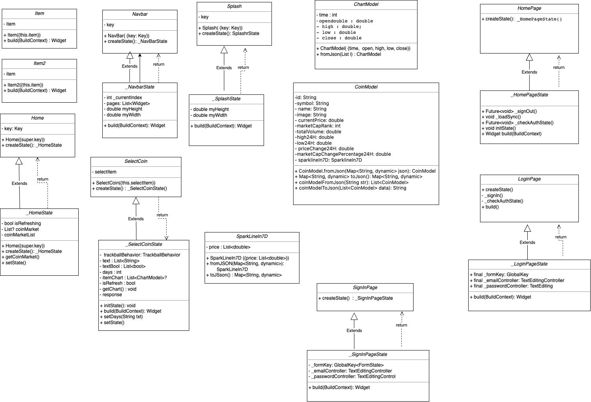

# Proiect-MDS
## Nume echipa
Blockfolio

## Componenta echipei
- Hanghicel Razvan-Mihai grupa 241
- Istrate Alexandru grupa 241
- Moraru Cristian grupa 241
- Sandor Cristian grupa 242

## Epic story

Într-un oraș modern și agitat, s-a născut o aplicație numită Blockfolio, cu un scop ambițios: să revoluționeze modul în care oamenii interacționau cu lumea criptomonedelor. Echipa talentată din spatele acestei aplicații a dorit să ofere o platformă intuitivă și prietenoasă, unde utilizatorii să poată cumpăra și vinde crypto într-un mod sigur și convenabil.

Blockfolio a fost concepută cu grijă pentru a oferi o experiență transparentă și captivantă utilizatorilor săi. Interfața sa simplă și elegantă a permis utilizatorilor să navigheze ușor prin diferitele criptomonede disponibile, oferindu-le informații complete despre fiecare monedă în parte. Utilizatorii au putut accesa grafice de preț în timp real, istoricul tranzacțiilor și noutăți relevante din lumea criptomonedelor.

Unul dintre aspectele cheie care a diferențiat Blockfolio de alte aplicații similare a fost funcționalitatea sa de istoric al tranzacțiilor. Utilizatorii au avut posibilitatea de a verifica cu ușurință fiecare tranzacție efectuată, inclusiv data, cantitatea și moneda implicată în fiecare tranzacție. Aceasta a contribuit la creșterea încrederii utilizatorilor în platformă și le-a oferit controlul total asupra portofoliilor lor de crypto.

În final, Blockfolio a schimbat fundamental modul în care oamenii interacționează cu lumea criptomonedelor. A adus accesibilitate și ușurință în tranzacționarea crypto și a deschis calea către o economie digitală dinamică și înfloritoare.

## Must have

1. As a User, I must initially register or log in if I have an account.
2. As a User, after logging in, my portfolio balance (in dollars) will appear.
3. As a User, on the main page I will be able to find a list of certain cryptocurrencies that can be accessed individually for more information.
4. As a User, at the bottom of the main page, I will be shown a list of cryptocurrencies that have recently risen or fallen.
5. As a User, when I click on a cryptocurrency ( on the icon ), its current value will appear.
6. As a User, when I view a cryptocurrency, a candlestick chart will appear. In addition, we can select a time frame to watch value fluctuations.
7. As a User, I can learn about a cryptocurrency by going to its page, where a text section with information will also be displayed.
8. As a User, we have the possibility to view the Transaction History.
9. As a User, we can find 2 buttons on the page, one for "BUY" and one for "SELL". The "BUY" button redirects you to a page where we will "simulate" the purchase. Analogous to "SELL".
10. As a User, when a cryptocurrency significantly increases or decreases in value, I will receive a notification (including when the application is not open) informing me of this currency.
11. As a User, I want to have a log out option.

## Should have

1. As a User, I want to give feedback in the app to the developers.
2. As a User, I want to have a search bar.

## Nice to have

1. As a User, I want to have 2FA.
2. As a User, I want to have a profile page where I can follow or be followed by others.

## Tehnologii folosite 

Flutter, Dart si Firebase

## Link catre Backlog

https://trello.com/b/l5pfZXHY/cryptoapp

## Diagrama UML

## Demo
[Demo](https://youtu.be/sMRG8ItMkUQ)
